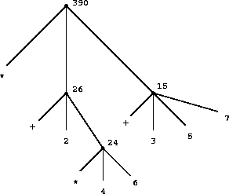

이 글은 프로그래밍의 기본 개념에 대해 설명하고 있어. 네가 컴퓨터랑 대화하면서 프로그래밍하는 방식을 알려주는 거지. 간단한 아이디어를 합쳐서 복잡한 아이디어를 만드는 방법에 초점을 맞춰.

모든 강력한 프로그래밍 언어에는 세 가지 중요한 기능이 있대.

- **기본 표현식**: 언어가 다루는 가장 단순한 것들이야. 예를 들어 숫자 같은 거지.
    
- **조합 수단**: 더 단순한 것들을 합쳐서 복잡한 것을 만드는 방법이야.
    
- **추상화 수단**: 복잡한 것들에 이름을 붙여서 하나의 단위처럼 다룰 수 있게 해주는 거지.
    

프로그래밍에서는 크게 두 가지를 다뤄. 바로 `프로시저(procedures)`랑 `데이터(data)`야. 데이터는 우리가 조작하고 싶은 `정보`이고, 프로시저는 이 데이터를 조작하는 `규칙`이라고 생각하면 돼. 그러니까 강력한 프로그래밍 언어라면 이런 기본 데이터와 프로시저를 표현하고, 조합하고, 추상화하는 방법이 있어야겠지?

이 장에서는 일단 간단한 숫자 데이터만 다룰 거야. 그래야 프로시저를 만드는 규칙에 집중할 수 있거든. 나중에 더 복잡한 데이터도 다루는 방법을 배울 거야.

### 1.1.1 표현식 (Expressions)

프로그래밍을 시작하는 쉬운 방법은 Lisp이라는 언어의 `인터프리터`랑 대화해보는 거야. 인터프리터는 네가 입력한 `표현식`을 해석하고 그 결과를 보여주는 프로그램이야.

예를 들어, 숫자를 입력하면 인터프리터가 그 숫자를 그대로 출력해줘.

Code snippet

```
486
```

이렇게 입력하면

Code snippet

```
486
```

이렇게 출력되는 거지.

숫자 표현식은 `+`나 `*` 같은 기본적인 `프로시저`랑 합쳐져서 더 복잡한 표현식을 만들 수 있어. 이걸 `조합(combinations)`이라고 불러.

Code snippet

```
(+ 137 349)
486

(- 1000 334)
666

(* 5 99)
495

(/ 10 5)
2

(+ 2.7 10)
12.7
```

괄호 안에 표현식들을 나열한 게 조합이야. 제일 왼쪽에 있는 게 `연산자(operator)`고, 나머지는 `피연산자(operands)`라고 해. 연산자가 가리키는 프로시저를 피연산자들의 값에 적용해서 조합의 값을 얻는 거야.

연산자를 왼쪽에 두는 방식을 `전위 표기법(prefix notation)`이라고 하는데, 처음엔 좀 헷갈릴 수 있어. 우리가 흔히 쓰는 수학 표현이랑 다르거든. 그래도 장점이 많아. 예를 들어, 인자(argument)를 여러 개 받을 수 있는 프로시저도 문제없어.

Code snippet

```
(+ 21 35 12 7)
75

(* 25 4 12)
1200
```

연산자가 항상 제일 왼쪽에 있고 전체 조합이 괄호로 묶여 있어서 헷갈릴 일이 없지.

또 다른 장점은 조합을 `중첩`해서 쓸 수 있다는 거야. 조합 안에 또 다른 조합을 넣는 거지.

Code snippet

```
(+ (* 3 5) (- 10 6))
19
```

이런 중첩은 원칙적으로 깊이의 제한이 없어. Lisp 인터프리터는 아무리 복잡한 표현식도 다 평가할 수 있어. 우리가 헷갈리는 건 비교적 간단한 이런 표현식이야.

Code snippet

```
(+ (* 3 (+ (* 2 4) (+ 3 5))) (+ (- 10 7) 6))
```

이걸 인터프리터가 57로 계산해 줄 건데, 우리 눈엔 복잡해 보이지. 이럴 땐 아래처럼 보기 좋게 정렬해서 쓰는 게 좋아. 이걸 `예쁘게 출력하기(pretty-printing)`라고 해. 이렇게 들여쓰기를 하면 표현식의 구조가 한눈에 보여.

복잡한 표현식이라도 인터프리터는 항상 똑같은 방식으로 작동해. 표현식을 읽고, 평가하고, 결과를 출력하는 거지. 이걸 `읽기-평가-출력 반복(read-eval-print loop)`이라고 해. 특별히 `출력해라`라고 지시할 필요 없이 항상 값이 출력돼.

### 1.1.2 이름 짓기 및 환경 (Naming and the Environment)

프로그래밍 언어에서 중요한 건 `이름`을 사용해서 계산 객체를 참조하는 방법이야. 이름은 `변수`를 식별하고, 변수의 `값`은 그 객체야.

Lisp의 Scheme 방언에서는 `define`을 사용해서 이름을 지어.

Code snippet

```
(define size 2)
```

이렇게 입력하면 인터프리터가 `size`라는 이름에 2라는 값을 연결해줘. 일단 `size`가 2랑 연결되면, 이제 `size`라고 부르면 2를 말하는 거야.

Code snippet

```
size
2

(* 5 size)
10
```

`define` 사용 예시를 더 볼까?

Code snippet

```
(define pi 3.14159)
(define radius 10)

(* pi (* radius radius))
314.159

(define circumference (* 2 pi radius))

circumference
62.8318
```

`define`은 우리 언어에서 가장 간단한 `추상화` 방법이야. `circumference`처럼 복잡한 계산 결과에 간단한 이름을 붙여줄 수 있게 해주거든. 보통 계산 객체는 구조가 아주 복잡할 수 있는데, 그걸 매번 기억하고 반복해서 쓰는 건 너무 불편하잖아. 사실 복잡한 프로그램은 이렇게 복잡도를 점점 쌓아가면서 만들어져. 인터프리터는 이름과 객체를 단계적으로 연결할 수 있어서 이런 단계적인 프로그램 작성을 아주 편리하게 해줘. 그래서 Lisp 프로그램은 보통 비교적 단순한 프로시저들이 많이 모여있는 형태가 돼.

값을 심볼(기호)과 연결하고 나중에 다시 불러올 수 있다는 건 인터프리터가 이름-객체 쌍을 기록하는 어떤 `기억 장치`를 가지고 있어야 한다는 뜻이야. 이 기억 장치를 `환경(environment)`이라고 불러. (더 정확히는 `전역 환경`이라고 하는데, 나중에 여러 환경이 있을 수 있다는 걸 배울 거야.)

### 1.1.3 조합 평가하기 (Evaluating Combinations)

이 장의 목표 중 하나는 `절차적 사고`에 대한 문제를 분리하는 거야. 예를 들어, 조합을 평가할 때 인터프리터 스스로도 어떤 절차를 따르고 있어.

> 조합을 평가하려면 다음을 수행해:
> 
> 1. 조합의 하위 표현식들을 평가해.
>     
> 2. 제일 왼쪽 하위 표현식(연산자)의 값인 프로시저를 다른 하위 표현식(피연산자)들의 값인 인자들에 적용해.

이 간단한 규칙도 일반적인 프로세스에 대해 중요한 점들을 보여줘. 첫째, 첫 번째 단계에서 조합의 평가 과정을 수행하려면 조합의 각 요소를 먼저 평가해야 한다고 나와 있어. 그러니까 평가 규칙은 `재귀적`이야. 즉, 자기 자신을 다시 호출하는 단계를 포함하고 있는 거지.

재귀라는 아이디어가 깊이 중첩된 조합의 경우 복잡하게 보일 수 있는 과정을 얼마나 간결하게 표현하는지 봐봐. 예를 들어, 다음을 평가하려면:

Code snippet

```
(* (+ 2 (* 4 6)) (+ 3 5 7))
```

평가 규칙이 네 가지 다른 조합에 적용되어야 해. 이 과정을 그림 1.1처럼 `트리` 형태로 나타내면 이해하기 쉬워. 각 조합은 연산자와 피연산자에 해당하는 가지를 가진 노드로 표현돼. 끝 노드(가지가 없는 노드)는 연산자나 숫자를 나타내. 트리를 통해 평가를 보면, 피연산자들의 값이 말단 노드에서 시작해서 점점 위로 올라가면서 결합되는 걸 상상할 수 있어. 일반적으로 재귀는 계층적이고 트리 같은 객체를 다루는 데 아주 강력한 기술이야. 사실, `값을 위로 퍼뜨리는` 평가 규칙은 `트리 누적`이라고 알려진 일반적인 과정의 예시야.



다음으로, 첫 번째 단계를 반복적으로 적용하면 조합이 아니라 숫자, 내장 연산자, 또는 다른 이름과 같은 `원시 표현식`을 평가해야 하는 지점에 도달한다는 걸 알 수 있어. 원시 표현식의 경우는 이렇게 처리해:

- 숫자의 값은 그 숫자 자체가 돼.
    
- 내장 연산자의 값은 해당 연산을 수행하는 기계어 명령어의 순서가 돼.
    
- 다른 이름의 값은 환경에서 그 이름과 연결된 객체가 돼.
    

두 번째 규칙은 `+`나 `*` 같은 심볼들도 전역 환경에 포함되어 있고, 그들의 `값`인 기계어 명령어 순서와 연결되어 있다고 가정하면 세 번째 규칙의 특별한 경우로 볼 수 있어. 여기서 중요한 점은 표현식에서 심볼의 의미를 결정하는 데 `환경`의 역할이야. Lisp과 같은 상호작용 언어에서는 `(+ x 1)`과 같은 표현식의 값에 대해 이야기하는 것이, 심볼 `x` (또는 심볼 `+`조차도)에 의미를 부여할 환경에 대한 정보를 지정하지 않고는 무의미해. 3장에서 보겠지만, 평가가 일어나는 맥락을 제공하는 환경의 일반적인 개념은 프로그램 실행을 이해하는 데 중요한 역할을 할 거야.

위에서 제시된 평가 규칙은 `정의(definitions)`를 처리하지 않아. 예를 들어, `(define x 3)`을 평가하는 것은 `define`을 두 개의 인자(하나는 심볼 `x`의 값이고 다른 하나는 3인)에 적용하는 것이 아니야. 왜냐하면 `define`의 목적은 정확히 `x`를 값에 연결하는 것이기 때문이지. (`(define x 3)`은 조합이 아니라는 뜻이야.)

이러한 일반적인 평가 규칙의 예외를 `특별 형식(special forms)`이라고 해. `define`은 우리가 지금까지 본 유일한 특별 형식인데, 곧 다른 특별 형식들도 볼 거야. 각 특별 형식은 자신만의 평가 규칙을 가지고 있어. 다양한 종류의 표현식(각각 관련 평가 규칙이 있음)은 프로그래밍 언어의 `구문(syntax)`을 구성해. 대부분의 다른 프로그래밍 언어와 비교했을 때, Lisp은 구문이 매우 간단해. 즉, 표현식에 대한 평가 규칙은 간단한 일반 규칙과 소수의 특별 형식에 대한 특수 규칙으로 설명될 수 있어.

### 1.1.4 복합 프로시저 (Compound Procedures)

우리는 지금까지 Lisp에서 강력한 프로그래밍 언어에 있어야 할 몇 가지 요소를 확인했어.

- 숫자와 산술 연산은 기본적인 데이터와 프로시저야.
    
- 조합의 중첩은 연산을 결합하는 수단을 제공해.
    
- 이름과 값을 연결하는 정의는 제한적인 추상화 수단을 제공해.
    

이제 우리는 `프로시저 정의`에 대해 배울 거야. 이것은 복합적인 연산에 이름을 부여하고 하나의 단위로 참조할 수 있게 해주는 훨씬 강력한 추상화 기술이야.

`제곱하기`라는 아이디어를 어떻게 표현하는지 살펴보자. "무언가를 제곱하려면, 그것을 자기 자신과 곱하면 돼." 이걸 우리 언어로 표현하면 이렇게 돼.

Code snippet

```
(define (square x) (* x x))
```

이것을 이렇게 이해할 수 있어:

Code snippet

```
(define (square x)    (*       x       x))
  |      |      |      |       |       |
 To square something, multiply it by itself.
```

우리는 `square`라는 이름이 붙은 `복합 프로시저`를 만들었어. 이 프로시저는 무언가를 자기 자신과 곱하는 연산을 나타내. 곱해질 `그것`에는 지역 이름 `x`가 붙어 있는데, 이건 자연어에서 대명사가 하는 역할과 같아. 정의를 평가하면 이 복합 프로시저가 생성되고 `square`라는 이름과 연결돼.

프로시저 정의의 일반적인 형태는 다음과 같아:

Code snippet

```
(define (⟨이름⟩ ⟨형식 매개변수들⟩) ⟨본문⟩)
```

`⟨이름⟩`은 환경에서 프로시저 정의와 연결될 심볼이야. `⟨형식 매개변수들⟩`은 프로시저 본문 안에서 프로시저의 해당 인자들을 참조하는 데 사용되는 이름들이야. `⟨본문⟩`은 형식 매개변수가 프로시저에 적용될 실제 인자들로 대체될 때 프로시저 적용의 값을 산출할 표현식이야. `⟨이름⟩`과 `⟨형식 매개변수들⟩`은 정의될 프로시저를 실제로 호출할 때처럼 괄호 안에 그룹화돼.

`square`를 정의했으니 이제 사용할 수 있어:

Code snippet

```
(square 21)
441

(square (+ 2 5))
49

(square (square 3))
81
```

`square`를 다른 프로시저를 정의하는 데 building block으로 사용할 수도 있어. 예를 들어, $x^{2} + y^{2}$는 다음과 같이 표현할 수 있어:

Code snippet

```
(+ (square x) (square y))
```

어떤 두 숫자를 인자로 받아서 그 숫자들의 제곱의 합을 계산하는 `sum-of-squares` 프로시저를 쉽게 정의할 수 있어:

Code snippet

```
(define (sum-of-squares x y)
  (+ (square x) (square y)))

(sum-of-squares 3 4)
25
```

이제 `sum-of-squares`를 더 많은 프로시저를 만드는 데 building block으로 사용할 수 있어:

Code snippet

```
(define (f a)
  (sum-of-squares (+ a 1) (* a 2)))

(f 5)
136
```

복합 프로시저는 기본 프로시저와 똑같은 방식으로 사용돼. 사실, 위에서 주어진 `sum-of-squares`의 정의만 봐서는 `square`가 `+`나 `*`처럼 인터프리터에 내장되어 있는지, 아니면 복합 프로시저로 정의되어 있는지 알 수 없을 거야.

### 1.1.5 프로시저 적용을 위한 대치 모델 (The Substitution Model for Procedure Application)

연산자가 복합 프로시저의 이름을 가진 조합을 평가하기 위해, 인터프리터는 1.1.3에서 설명한 원시 프로시저의 이름을 가진 조합과 거의 동일한 과정을 따라. 즉, 인터프리터는 조합의 요소들을 평가하고 (조합의 연산자의 값인) 프로시저를 (조합의 피연산자들의 값인) 인자들에 적용해.

원시 프로시저를 인자에 적용하는 메커니즘은 인터프리터에 내장되어 있다고 가정할 수 있어. 복합 프로시저의 경우, 적용 과정은 다음과 같아:

> 복합 프로시저를 인자에 적용하려면, 각 형식 매개변수를 해당 인자로 대체하여 프로시저의 본문을 평가해.

이 과정을 설명하기 위해 `(f 5)` 조합을 평가해보자. `f`는 1.1.4에서 정의된 프로시저야. 먼저 `f`의 본문을 가져와:

Code snippet

```
(sum-of-squares (+ a 1) (* a 2))
```

그런 다음 형식 매개변수 `a`를 인자 5로 대체해:

Code snippet

```
(sum-of-squares (+ 5 1) (* 5 2))
```

따라서 문제는 두 개의 피연산자와 `sum-of-squares` 연산자를 가진 조합의 평가로 줄어들어. 이 조합을 평가하려면 세 가지 하위 문제가 있어. 적용할 프로시저를 얻기 위해 연산자를 평가해야 하고, 인자를 얻기 위해 피연산자를 평가해야 해. 이제 `(+ 5 1)`은 6을, `(* 5 2)`는 10을 생성하므로, `sum-of-squares` 프로시저를 6과 10에 적용해야 해. 이 값들은 `sum-of-squares`의 본문에서 형식 매개변수 `x`와 `y`를 대체하여 표현식을 다음으로 줄여줘:

Code snippet

```
(+ (square 6) (square 10))
```

`square`의 정의를 사용하면 다음으로 줄어들어:

Code snippet

```
(+ (* 6 6) (* 10 10))
```

이는 곱셈에 의해 다음으로 줄어들고:

Code snippet

```
(+ 36 100)
```

마지막으로 다음이 돼:

Code snippet

```
136
```

우리가 방금 설명한 과정을 `대치 모델(substitution model)`이라고 불러. 이 장의 프로시저들과 관련해서는 프로시저 적용의 `의미`를 결정하는 모델로 사용할 수 있어. 하지만 두 가지 강조할 점이 있어:

- 대치의 목적은 프로시저 적용에 대해 생각하는 데 도움을 주기 위한 것이지, 인터프리터가 실제로 어떻게 작동하는지에 대한 설명을 제공하기 위한 것이 아니야. 일반적인 인터프리터는 형식 매개변수에 값을 대치하기 위해 프로시저의 텍스트를 조작하여 프로시저 적용을 평가하지 않아. 실제로는 `대치`가 형식 매개변수를 위한 지역 환경을 사용하여 이루어져. 3장과 4장에서 인터프리터의 구현을 자세히 살펴볼 때 더 자세히 논의할 거야.
    
- 이 책을 통틀어, 우리는 인터프리터가 어떻게 작동하는지에 대한 점점 더 정교한 모델들을 제시할 것이고, 5장에서는 인터프리터와 컴파일러의 완전한 구현으로 마무리할 거야. 대치 모델은 이 모델들 중 첫 번째일 뿐이야. 평가 과정에 대해 공식적으로 생각하기 시작하는 방법이지. 일반적으로 과학 및 공학에서 현상을 모델링할 때, 우리는 단순화되고 불완전한 모델로 시작해. 더 자세히 살펴볼수록 이러한 단순한 모델은 부적절해지고 더 정교한 모델로 대체되어야 해. 대치 모델도 예외는 아니야. 특히, 3장에서 `가변 데이터`를 가진 프로시저 사용을 다룰 때, 대치 모델이 한계에 부딪히고 더 복잡한 프로시저 적용 모델로 대체되어야 한다는 것을 알게 될 거야.
    

#### 적용 순서 vs. 일반 순서 (Applicative order versus normal order)

1.1.3에서 설명한 평가 방식에 따르면, 인터프리터는 먼저 연산자와 피연산자를 평가한 다음, 그 결과로 나온 프로시저를 그 결과로 나온 인자에 적용해. 하지만 평가를 수행하는 방법은 이것만이 아니야. 다른 평가 모델은 피연산자의 값이 필요할 때까지 피연산자를 평가하지 않아. 대신, 원시 연산자만 포함하는 표현식을 얻을 때까지 피연산자 표현식을 매개변수로 대체하고, 그 후에 평가를 수행해. 이 방법을 사용하면 `(f 5)`의 평가는 다음과 같은 확장 순서로 진행될 거야.

Code snippet

```
(sum-of-squares (+ 5 1) (* 5 2))

(+ (square (+ 5 1))
   (square (* 5 2)))

(+ (* (+ 5 1) (+ 5 1))
   (* (* 5 2) (* 5 2)))
```

그 다음에는 다음과 같은 축소 과정을 거쳐.

Code snippet

```
(+ (* 6 6)
   (* 10 10))

(+ 36 100)

136
```

이것은 이전 평가 모델과 같은 답을 주지만, 과정이 달라. 특히, `(+ 5 1)`과 `(* 5 2)`의 평가는 여기서 각각 두 번씩 수행되는데, 이는 `x`가 각각 `(+ 5 1)`과 `(* 5 2)`로 대체된 `(* x x)` 표현식의 축소에 해당해.

이러한 대체 “완전히 확장한 다음 축소하는” 평가 방법을 `일반 순서 평가(normal-order evaluation)`라고 해. 반면에 인터프리터가 실제로 사용하는 “인자를 평가한 다음 적용하는” 방법을 `적용 순서 평가(applicative-order evaluation)`라고 불러. 대치를 사용하여 모델링할 수 있고 (이 책의 첫 두 장의 모든 프로시저를 포함하여) 유효한 값을 산출하는 프로시저 적용의 경우, 일반 순서 평가와 적용 순서 평가가 동일한 값을 생성한다는 것을 보여줄 수 있어. (적용 순서와 일반 순서 평가가 다른 결과를 주는 “유효하지 않은” 값의 예를 보려면 1.5번 연습문제를 봐봐.)

Lisp은 적용 순서 평가를 사용하는데, 부분적으로는 위에서 `(+ 5 1)`과 `(* 5 2)`에서 보여준 것처럼 표현식의 여러 번 평가를 피하여 추가적인 효율성을 얻기 때문이고, 더 중요한 것은 대치로 모델링할 수 있는 프로시저의 영역을 벗어나면 일반 순서 평가가 훨씬 더 복잡해지기 때문이야. 반면에 일반 순서 평가는 매우 유용한 도구가 될 수 있으며, 우리는 3장과 4장에서 그 함의 중 일부를 탐구할 거야.

### 1.1.6 조건식과 술어 (Conditional Expressions and Predicates)

우리가 지금까지 정의할 수 있는 프로시저의 표현력은 매우 제한적이야. 왜냐하면 `테스트`를 하고 테스트 결과에 따라 다른 연산을 수행하는 방법이 없기 때문이지. 예를 들어, 숫자의 절대값을 계산하는 프로시저를 정의할 수 없어. 숫자가 양수인지, 음수인지, 0인지 테스트하고 다음 규칙에 따라 다른 동작을 취해야 하는데 말이야.

$$\left| x \right|\; = \;\left\{ \begin{array}{lll}
x & {\;\text{if}} & {x > 0,} \\
0 & {\;\text{if}} & {x = 0,} \\
{- x} & {\;\text{if}} & {x < 0.} \\
\end{array} \right.$$

이런 구성을 `케이스 분석(case analysis)`이라고 하고, Lisp에는 이런 케이스 분석을 표기하기 위한 특별한 형식이 있어. 그것은 `cond` (조건부의 약자)라고 불리며, 다음과 같이 사용돼:

Code snippet

```
(define (abs x)
  (cond ((> x 0) x)
        ((= x 0) 0)
        ((< x 0) (- x))))
```

조건식의 일반적인 형태는 다음과 같아:

Code snippet

```
(cond (⟨p₁⟩ ⟨e₁⟩)
      (⟨p₂⟩ ⟨e₂⟩)
      …
      (⟨pₙ⟩ ⟨eₙ⟩))
```

이것은 `cond` 심볼 뒤에 괄호로 묶인 표현식 쌍으로 구성돼.

Code snippet

```
(⟨p⟩ ⟨e⟩)
```

각 쌍의 첫 번째 표현식은 `술어(predicate)`야. 즉, 값이 참 또는 거짓으로 해석되는 표현식이지.

조건식은 다음과 같이 평가돼. 먼저 `<p1>` 술어가 평가돼. 만약 그 값이 거짓이면 `<p2>`가 평가돼. `<p2>`의 값도 거짓이면 `<p3>`가 평가돼. 이 과정은 값이 참인 술어를 찾을 때까지 계속돼. 참인 술어가 발견되면 인터프리터는 해당 절의 `귀결 표현식(consequent expression)` `<e>`의 값을 조건식의 값으로 반환해. 만약 어떤 `<p>`도 참으로 판명되지 않으면 `cond`의 값은 정의되지 않아.

`술어`라는 단어는 참 또는 거짓을 반환하는 프로시저뿐만 아니라 참 또는 거짓으로 평가되는 표현식에도 사용돼. 절대값 프로시저 `abs`는 기본 술어인 `>`, `<`, `=`를 사용해. 이 술어들은 두 숫자를 인자로 받아서 첫 번째 숫자가 두 번째 숫자보다 각각 크거나, 작거나, 같으면 참 또는 거짓을 반환해.

절대값 프로시저를 작성하는 또 다른 방법은 다음과 같아:

Code snippet

```
(define (abs x)
  (cond ((< x 0) (- x))
        (else x)))
```

이것은 영어로 "만약 x가 0보다 작으면 −x를 반환하고, 그렇지 않으면 x를 반환해라"로 표현될 수 있어. `else`는 `cond`의 마지막 절에서 `<p>` 대신 사용할 수 있는 특별한 심볼이야. 이것은 이전의 모든 절이 건너뛰어졌을 때 해당 `<e>`의 값을 `cond`의 값으로 반환하도록 해. 사실, 항상 참으로 평가되는 어떤 표현식도 여기 `<p>`로 사용될 수 있어.

절대값 프로시저를 작성하는 또 다른 방법은 다음과 같아:

Code snippet

```
(define (abs x)
  (if (< x 0)
      (- x)
      x))
```

이것은 `if`라는 특별한 형식을 사용하는데, 케이스 분석에 정확히 두 가지 경우가 있을 때 사용할 수 있는 제한된 유형의 조건문이야. `if` 표현식의 일반적인 형태는 다음과 같아:

Code snippet

```
(if ⟨술어⟩ ⟨귀결⟩ ⟨대안⟩)
```

`if` 표현식을 평가하려면, 인터프리터는 먼저 표현식의 `⟨술어⟩` 부분을 평가해. 만약 `⟨술어⟩`가 참 값을 평가하면, 인터프리터는 `⟨귀결⟩`을 평가하고 그 값을 반환해. 그렇지 않으면 `⟨대안⟩`을 평가하고 그 값을 반환해.

`<`, `=`, `>`와 같은 기본 술어 외에도, 복합 술어를 구성할 수 있는 논리 합성 연산이 있어. 가장 자주 사용되는 세 가지는 다음과 같아:

- `(and ⟨e₁⟩ … ⟨eₙ⟩)`
    
    인터프리터는 표현식 `⟨e⟩`들을 왼쪽에서 오른쪽으로 하나씩 평가해. 만약 어떤 `⟨e⟩`가 거짓으로 평가되면, `and` 표현식의 값은 거짓이 되고, 나머지 `⟨e⟩`들은 평가되지 않아. 만약 모든 `⟨e⟩`들이 참 값으로 평가되면, `and` 표현식의 값은 마지막 `⟨e⟩`의 값이야.
    
- `(or ⟨e₁⟩ … ⟨eₙ⟩)`
    
    인터프리터는 표현식 `⟨e⟩`들을 왼쪽에서 오른쪽으로 하나씩 평가해. 만약 어떤 `⟨e⟩`가 참 값으로 평가되면, 그 값이 `or` 표현식의 값으로 반환되고, 나머지 `⟨e⟩`들은 평가되지 않아. 만약 모든 `⟨e⟩`들이 거짓으로 평가되면, `or` 표현식의 값은 거짓이야.
    
- `(not ⟨e⟩)`
    
    `not` 표현식의 값은 표현식 `⟨e⟩`가 거짓으로 평가될 때 참이고, 그렇지 않으면 거짓이야.
    

`and`와 `or`는 특별 형식이지 프로시저가 아니라는 점에 주목해. 왜냐하면 하위 표현식들이 반드시 모두 평가되는 것은 아니기 때문이야. `not`은 일반적인 프로시저야.

이것들이 어떻게 사용되는지 예시를 들자면, 숫자 x가 5 < x < 10 범위에 있다는 조건은 다음과 같이 표현할 수 있어:

Code snippet

```
(and (> x 5) (< x 10))
```

또 다른 예시로, 한 숫자가 다른 숫자보다 크거나 같은지 테스트하는 술어를 다음과 같이 정의할 수 있어:

Code snippet

```
(define (>= x y)
  (or (> x y) (= x y)))
```

또는 다른 방식으로 다음과 같이 정의할 수도 있어:

Code snippet

```
(define (>= x y)
  (not (< x y)))
```

**연습문제 1.1:** 다음은 표현식들의 순서야. 각 표현식에 대해 인터프리터가 출력하는 결과는 무엇일까? 순서대로 평가된다고 가정해봐.

Code snippet

```
10
(+ 5 3 4)
(- 9 1)
(/ 6 2)
(+ (* 2 4) (- 4 6))
(define a 3)
(define b (+ a 1))
(+ a b (* a b))
(= a b)
(if (and (> b a) (< b (* a b)))
    b
    a)
(cond ((= a 4) 6)
      ((= b 4) (+ 6 7 a))
      (else 25))
(+ 2 (if (> b a) b a))
(* (cond ((> a b) a)
         ((< a b) b)
         (else -1))
   (+ a 1))
```

**연습문제 1.2:** 다음 표현식을 전위 표기법으로 번역해봐:

$$\frac{5 + 4 + (2 - (3 - (6 + \frac{4}{5})))}{3(6 - 2)(2 - 7)}.$$

**연습문제 1.3:** 세 개의 숫자를 인자로 받아서, 그 중 큰 두 숫자의 제곱의 합을 반환하는 프로시저를 정의해봐.

**연습문제 1.4:** 우리의 평가 모델은 연산자가 복합 표현식인 조합도 허용한다는 점을 살펴봐. 이 관찰을 사용하여 다음 프로시저의 동작을 설명해봐:

Code snippet

```
(define (a-plus-abs-b a b)
  ((if (> b 0) + -) a b))
```

**연습문제 1.5:** 벤 비티들은 자신이 사용하는 인터프리터가 적용 순서 평가를 사용하는지 일반 순서 평가를 사용하는지 판별하는 테스트를 고안했어. 그는 다음 두 프로시저를 정의했어:

Code snippet

```
(define (p) (p))

(define (test x y)
  (if (= x 0)
      0
      y))
```

그 다음 그는 다음 표현식을 평가했어:

Code snippet

```
(test 0 (p))
```

적용 순서 평가를 사용하는 인터프리터에서 벤은 어떤 동작을 관찰할까? 일반 순서 평가를 사용하는 인터프리터에서 그는 어떤 동작을 관찰할까? 네 답변을 설명해봐. (`if` 특별 형식에 대한 평가 규칙은 인터프리터가 일반 순서든 적용 순서든 동일하다고 가정해: 술어 표현식이 먼저 평가되고, 그 결과에 따라 귀결 또는 대안 표현식을 평가할지 결정돼.)

### 1.1.7 예시: 뉴턴 방법으로 제곱근 구하기 (Example: Square Roots by Newton’s Method)

앞에서 소개된 프로시저들은 보통의 수학 함수와 매우 비슷해. 하나 이상의 매개변수에 의해 결정되는 값을 지정하거든. 하지만 수학 함수와 컴퓨터 프로시저 사이에는 중요한 차이점이 있어. 프로시저는 `유효해야 해`.

제곱근 계산 문제를 예로 들어보자. 우리는 제곱근 함수를 다음과 같이 정의할 수 있어:

$$\sqrt{x}\;\; = \;\;{\text{the}\;\; y}\;\;\text{such\ that}\;\;{y \geq 0}\;\;{\text{and}\;\; y^{2} = x.}$$

이것은 완벽하게 합법적인 수학 함수를 설명해. 우리는 이것을 사용하여 한 숫자가 다른 숫자의 제곱근인지 인식하거나 제곱근에 대한 일반적인 사실을 도출할 수 있어. 반면에, 이 정의는 프로시저를 설명하지 않아. 사실, 주어진 숫자의 제곱근을 실제로 어떻게 찾는지에 대해서는 거의 아무것도 알려주지 않아. 이 정의를 유사-Lisp으로 바꿔도 마찬가지야:

Code snippet

```
(define (sqrt x)
  (the y (and (>= y 0)
              (= (square y) x))))
```

이것은 단지 질문을 회피하는 것뿐이야.

함수와 프로시저의 대조는 사물의 속성을 묘사하는 것과 사물을 `어떻게` 하는지 묘사하는 것 사이의 일반적인 구별을 반영해. 또는 때로는 선언적 지식과 명령적 지식의 구별이라고도 해. 수학에서는 주로 선언적(무엇이 있는가) 묘사에 관심이 있지만, 컴퓨터 과학에서는 주로 명령적(어떻게 하는가) 묘사에 관심이 있어.

그렇다면 제곱근은 어떻게 계산할까? 가장 일반적인 방법은 `뉴턴의 연속 근사법`을 사용하는 거야. 이 방법은 어떤 숫자 x의 제곱근에 대한 추측 y가 있을 때, y와 x/y를 평균내어 더 나은 추측(실제 제곱근에 더 가까운)을 얻기 위해 간단한 조작을 수행할 수 있다고 말해. 예를 들어, 2의 제곱근을 다음과 같이 계산할 수 있어. 초기 추측이 1이라고 가정해보자:

Code snippet

```
추측     몫          평균

1         (2/1)  = 2    ((2 + 1)/2)  = 1.5

1.5       (2/1.5)       ((1.3333 + 1.5)/2)
            = 1.3333      = 1.4167

1.4167    (2/1.4167)    ((1.4167 + 1.4118)/2)
            = 1.4118      = 1.4142

1.4142    ...           ...
```

이 과정을 계속하면 제곱근에 대한 점점 더 나은 근사치를 얻을 수 있어.

이제 프로시저 관점에서 이 과정을 공식화해보자. 우리는 피제곱근(제곱근을 계산하려는 숫자)과 추측 값을 가지고 시작해. 추측이 우리의 목적에 충분히 좋다면, 작업은 끝이야. 그렇지 않다면, 개선된 추측으로 과정을 반복해야 해. 이 기본적인 전략을 프로시저로 작성하면 다음과 같아:

Code snippet

```
(define (sqrt-iter guess x)
  (if (good-enough? guess x)
      guess
      (sqrt-iter (improve guess x) x)))
```

추측은 그것을 피제곱근과 이전 추측의 몫과 평균내어 개선돼:

Code snippet

```
(define (improve guess x)
  (average guess (/ x guess)))
```

여기서

Code snippet

```
(define (average x y)
  (/ (+ x y) 2))
```

우리는 또한 "충분히 좋은" 것이 무엇을 의미하는지 말해야 해. 다음은 설명을 위해 충분하지만, 실제로는 아주 좋은 테스트는 아니야. (1.7번 연습문제 참조.) 아이디어는 답이 제곱과 피제곱근의 차이가 미리 정해진 허용 오차(여기서는 0.001)보다 작을 때까지 답을 개선하는 거야:

Code snippet

```
(define (good-enough? guess x)
  (< (abs (- (square guess) x)) 0.001))
```

마지막으로, 시작할 방법이 필요해. 예를 들어, 우리는 항상 어떤 숫자의 제곱근도 1이라고 추측할 수 있어:

Code snippet

```
(define (sqrt x)
  (sqrt-iter 1.0 x))
```

이 정의들을 인터프리터에 입력하면, 우리는 다른 프로시저처럼 `sqrt`를 사용할 수 있어:

Code snippet

```
(sqrt 9)
3.00009155413138

(sqrt (+ 100 37))
11.704699917758145

(sqrt (+ (sqrt 2) (sqrt 3)))
1.7739279023207892

(square (sqrt 1000))
1000.000369924366
```

`sqrt` 프로그램은 우리가 지금까지 소개한 간단한 절차적 언어가 C나 Pascal로 작성할 수 있는 순수 수치 프로그램을 작성하는 데 충분하다는 것을 보여줘. 이것은 우리 언어에 컴퓨터가 반복해서 작업을 수행하도록 지시하는 반복(루프) 구조가 포함되어 있지 않기 때문에 놀라울 수 있어. `sqrt-iter`는 반면에 일반적인 프로시저 호출 능력 외에 특별한 구조 없이도 반복이 어떻게 이루어질 수 있는지를 보여줘.

**연습문제 1.6:** 앨리사 P. 해커는 `if`가 왜 특별 형식으로 제공되어야 하는지 이해하지 못했어. "왜 `cond`를 사용해서 일반적인 프로시저로 정의할 수 없나요?"라고 그녀는 물었어. 앨리사의 친구 이바 루 에이토어는 실제로 그렇게 할 수 있다고 주장하며 새로운 버전의 `if`를 정의했어:

Code snippet

```
(define (new-if predicate
                then-clause
                else-clause)
  (cond (predicate then-clause)
        (else else-clause)))
```

이바는 앨리사에게 프로그램을 시연했어:

Code snippet

```
(new-if (= 2 3) 0 5)
5

(new-if (= 1 1) 0 5)
0
```

기뻐서, 앨리사는 `new-if`를 사용하여 제곱근 프로그램을 다시 작성했어:

Code snippet

```
(define (sqrt-iter guess x)
  (new-if (good-enough? guess x)
          guess
          (sqrt-iter (improve guess x) x)))
```

앨리사가 이것을 사용하여 제곱근을 계산하려고 할 때 무슨 일이 일어날까? 설명해봐.

**연습문제 1.7:** 제곱근 계산에 사용된 `good-enough?` 테스트는 매우 작은 숫자의 제곱근을 찾는 데는 별로 효과적이지 않을 거야. 또한, 실제 컴퓨터에서는 산술 연산이 거의 항상 제한된 정밀도로 수행돼. 이 때문에 우리의 테스트는 매우 큰 숫자에는 부적절해. 이 진술들을 설명하고, 테스트가 작은 숫자와 큰 숫자에서 어떻게 실패하는지 예시를 들어봐. `good-enough?`를 구현하는 다른 전략은 `guess`가 한 반복에서 다음 반복으로 어떻게 변하는지 관찰하고, 변화가 추측의 아주 작은 부분일 때 멈추는 거야. 이런 종류의 종료 테스트를 사용하는 제곱근 프로시저를 설계해봐. 이것이 작은 숫자와 큰 숫자에서 더 잘 작동할까?

**연습문제 1.8:** 세제곱근에 대한 뉴턴 방법은 y가 x의 세제곱근에 대한 근사값이라면, 더 나은 근사값은 다음 값으로 주어진다는 사실에 기반해:

$$\frac{{x/y^{2}} + 2y}{3}.$$

이 공식을 사용하여 제곱근 프로시저와 유사한 세제곱근 프로시저를 구현해봐. (1.3.4에서는 이 제곱근 및 세제곱근 프로시저의 추상화로서 일반적인 뉴턴 방법을 Lisp 프로시저로 구현하는 방법을 볼 거야.)

### 1.1.8 프로시저를 블랙박스 추상화로 (Procedures as Black-Box Abstractions)

`sqrt`는 우리가 처음으로 접하는, 상호 정의된 프로시저들로 정의된 프로세스의 예시야. `sqrt-iter`의 정의가 `재귀적`이라는 점에 주목해. 즉, 프로시저가 자기 자신을 사용하여 정의되고 있어. 프로시저를 자기 자신을 사용하여 정의할 수 있다는 아이디어가 혼란스러울 수도 있어. 그런 `순환적인` 정의가 어떻게 의미가 있고, 컴퓨터에 의해 수행될 잘 정의된 프로세스를 지정할 수 있는지 명확하지 않을 수 있지. 이 부분은 1.2에서 더 자세히 다룰 거야. 하지만 먼저 `sqrt` 예시가 보여주는 다른 중요한 점들을 살펴보자.

제곱근을 계산하는 문제는 `충분히 좋은` 추측인지 확인하는 방법, 추측을 개선하는 방법 등 여러 하위 문제로 자연스럽게 나뉜다는 것을 알 수 있어. 각 작업은 별도의 프로시저로 수행돼. 전체 `sqrt` 프로그램은 그림 1.2에 나와 있는 것처럼 문제의 하위 문제 분해를 반영하는 프로시저들의 `클러스터`로 볼 수 있어.


이 분해 전략의 중요성은 단순히 프로그램을 여러 부분으로 나누는 데 있는 게 아니야. 결국, 어떤 큰 프로그램이라도 첫 10줄, 다음 10줄 등으로 나눌 수는 있겠지. 오히려 각 프로시저가 다른 프로시저를 정의하는 데 `모듈`로 사용될 수 있는 식별 가능한 작업을 수행한다는 것이 중요해. 예를 들어, `good-enough?` 프로시저를 `square`를 사용하여 정의할 때, 우리는 `square` 프로시저를 `블랙박스`로 간주할 수 있어. 그 순간에는 프로시저가 결과를 `어떻게` 계산하는지에는 관심이 없고, 단지 제곱을 계산한다는 사실에만 관심이 있지. 제곱이 어떻게 계산되는지에 대한 세부 사항은 나중에 고려하도록 숨길 수 있어. 사실, `good-enough?` 프로시저와 관련해서 `square`는 프로시저라기보다는 프로시저의 `추상화`, 즉 `절차적 추상화`라고 할 수 있어. 이 추상화 수준에서는 제곱을 계산하는 어떤 프로시저도 똑같이 좋아.

따라서 반환하는 값만 고려하면 숫자를 제곱하는 다음 두 프로시저는 구별할 수 없어야 해. 각각 숫자 인수를 받아서 그 숫자의 제곱을 값으로 생성하거든.

Code snippet

```
(define (square x) (* x x))

(define (square x)
  (exp (double (log x))))

(define (double x) (+ x x))
```

그러니까 프로시저 정의는 세부 사항을 숨길 수 있어야 해. 프로시저 사용자는 프로시저를 직접 작성하지 않았을 수도 있고, 다른 프로그래머로부터 블랙박스로 얻었을 수도 있어. 사용자는 프로시저를 사용하기 위해 그것이 어떻게 구현되었는지 알 필요가 없어야 해.

#### 지역 이름 (Local names)

프로시저 사용자는 프로시저 구현의 한 가지 세부 사항에 대해 신경 쓸 필요가 없어. 바로 구현자가 프로시저의 형식 매개변수에 대해 선택한 이름이야. 따라서 다음 프로시저들은 구별할 수 없어야 해:

Code snippet

```
(define (square x) (* x x))
(define (square y) (* y y))
```

프로시저의 의미는 작성자가 사용한 매개변수 이름과 독립적이어야 한다는 이 원칙은 겉보기에는 자명해 보이지만, 그 결과는 심오해. 가장 간단한 결과는 프로시저의 매개변수 이름이 프로시저 본문에 대해 `지역적`이어야 한다는 거야. 예를 들어, 우리는 제곱근 프로시저의 `good-enough?` 정의에서 `square`를 사용했어:

Code snippet

```
(define (good-enough? guess x)
  (< (abs (- (square guess) x)) 0.001))
```

`good-enough?` 작성자의 의도는 첫 번째 인수의 제곱이 두 번째 인수와 주어진 허용 오차 내에 있는지 확인하는 것이었어. 우리는 `good-enough?` 작성자가 첫 번째 인수를 참조하기 위해 `guess`라는 이름을 사용했고, 두 번째 인수를 참조하기 위해 `x`라는 이름을 사용했다는 것을 알 수 있어. `square`의 인수는 `guess`야. 만약 `square` 작성자가 그 인수를 참조하기 위해 `x` (위에서처럼)를 사용했다면, `good-enough?`의 `x`는 `square`의 `x`와는 다른 `x`여야 한다는 것을 알 수 있어. `square` 프로시저를 실행하는 것이 `good-enough?`가 사용하는 `x`의 값에 영향을 미쳐서는 안 돼. 왜냐하면 `square`가 계산을 마친 후에도 `good-enough?`에서 `x`의 값이 필요할 수 있기 때문이지.

만약 매개변수들이 각 프로시저의 본문에 대해 지역적이지 않다면, `square`의 매개변수 `x`가 `good-enough?`의 매개변수 `x`와 혼동될 수 있고, `good-enough?`의 동작은 우리가 사용한 `square`의 버전에 따라 달라질 거야. 따라서 `square`는 우리가 원했던 블랙박스가 아닐 거야.

프로시저의 형식 매개변수는 프로시저 정의에서 매우 특별한 역할을 하는데, 형식 매개변수의 이름이 무엇이든 상관없다는 점이야. 이런 이름을 `바운드 변수(bound variable)`라고 부르고, 프로시저 정의가 형식 매개변수를 `바인딩한다(binds)`고 말해. 바운드 변수가 정의 전체에서 일관되게 이름이 변경되어도 프로시저 정의의 의미는 변하지 않아. 변수가 바인딩되지 않으면 `자유 변수(free)`라고 해. 바인딩이 이름을 정의하는 표현식의 집합을 그 이름의 `스코프(scope)`라고 해. 프로시저 정의에서, 프로시저의 형식 매개변수로 선언된 바운드 변수는 프로시저의 본문을 자신의 스코프로 가져.

위의 `good-enough?` 정의에서 `guess`와 `x`는 바운드 변수이지만, `<`, `-`, `abs`, `square`는 자유 변수야. `good-enough?`의 의미는 우리가 `guess`와 `x`에 대해 선택하는 이름이 다르다면, 그리고 `<`, `-`, `abs`, `square`와 다르다면, 그 이름들과 독립적이어야 해. (만약 `guess`를 `abs`로 이름을 바꾸면 `abs` 변수를 `포획`하여 버그를 만들었을 거야. 그것은 자유에서 바운드로 바뀌었을 테니까.) 그러나 `good-enough?`의 의미는 자유 변수의 이름과 독립적이지 않아. 그것은 분명히 `abs` 심볼이 숫자의 절대값을 계산하는 프로시저의 이름이라는 사실(이 정의 외부에 있는)에 의존해. `good-enough?`는 정의에서 `abs`를 `cos`로 대체하면 다른 함수를 계산할 거야.

#### 내부 정의와 블록 구조 (Internal definitions and block structure)

우리는 지금까지 한 가지 종류의 이름 격리만 사용할 수 있었어: 프로시저의 형식 매개변수는 프로시저 본문에 지역적이라는 점이야. 제곱근 프로그램은 우리가 이름 사용을 제어하고 싶은 또 다른 방법을 보여줘. 기존 프로그램은 별도의 프로시저로 구성되어 있어:

Code snippet

```
(define (sqrt x)
  (sqrt-iter 1.0 x))

(define (sqrt-iter guess x)
  (if (good-enough? guess x)
      guess
      (sqrt-iter (improve guess x) x)))

(define (good-enough? guess x)
  (< (abs (- (square guess) x)) 0.001))

(define (improve guess x)
  (average guess (/ x guess)))
```

이 프로그램의 문제점은 `sqrt` 사용자들이 중요하게 생각하는 프로시저는 `sqrt`뿐이라는 거야. 다른 프로시저들 (`sqrt-iter`, `good-enough?`, `improve`)은 그들의 머리를 혼란스럽게 할 뿐이지. 그들은 제곱근 프로그램과 함께 작동하기 위해 다른 프로그램의 일부로 `good-enough?`라는 다른 프로시저를 정의할 수 없어. 왜냐하면 `sqrt`가 그것을 필요로 하기 때문이야. 이 문제는 많은 프로그래머들이 별도로 큰 시스템을 구축할 때 특히 심각해. 예를 들어, 대규모 수치 프로시저 라이브러리를 구축할 때, 많은 수치 함수는 연속 근사치로 계산되므로 보조 프로시저로 `good-enough?`와 `improve`라는 이름을 가질 수 있어. 우리는 하위 프로시저들을 `sqrt` 안에 숨겨서 `sqrt`가 다른 연속 근사치와 공존할 수 있도록 하고 싶어. 각각 자신만의 개인적인 `good-enough?` 프로시저를 가질 수 있도록 말이야. 이를 가능하게 하기 위해, 프로시저가 해당 프로시저에 지역적인 `내부 정의`를 가질 수 있도록 허용해. 예를 들어, 제곱근 문제에서 우리는 다음과 같이 작성할 수 있어:

Code snippet

```
(define (sqrt x)
  (define (good-enough? guess x)
    (< (abs (- (square guess) x)) 0.001))
  (define (improve guess x)
    (average guess (/ x guess)))
  (define (sqrt-iter guess x)
    (if (good-enough? guess x)
        guess
        (sqrt-iter (improve guess x) x)))
  (sqrt-iter 1.0 x))
```

이러한 정의의 `블록 구조(block structure)`라고 불리는 중첩은 가장 간단한 이름 패키징 문제에 대한 기본적으로 올바른 해결책이야. 하지만 여기에 더 좋은 아이디어가 숨어 있어. 보조 프로시저들의 정의를 내부화하는 것 외에도, 우리는 그것들을 단순화할 수 있어. `x`는 `sqrt`의 정의에서 바운드되어 있으므로, `sqrt` 내부에 정의된 `good-enough?`, `improve`, `sqrt-iter` 프로시저는 `x`의 스코프 안에 있어. 따라서 이 프로시저들에 `x`를 명시적으로 전달할 필요가 없어. 대신, `x`가 내부 정의에서 자유 변수가 되도록 허용할 수 있어. 아래에 나와 있는 것처럼 말이야. 그러면 `x`는 둘러싸는 프로시저 `sqrt`가 호출될 때 인자로부터 값을 얻게 돼. 이 원칙을 `어휘적 스코핑(lexical scoping)` 이라고 해.

Code snippet

```
(define (sqrt x)
  (define (good-enough? guess)
    (< (abs (- (square guess) x)) 0.001))
  (define (improve guess)
    (average guess (/ x guess)))
  (define (sqrt-iter guess)
    (if (good-enough? guess)
        guess
        (sqrt-iter (improve guess))))
  (sqrt-iter 1.0))
```

우리는 블록 구조를 광범위하게 사용하여 큰 프로그램을 다루기 쉬운 부분으로 나눌 거야. 블록 구조의 개념은 프로그래밍 언어 Algol 60에서 유래했어. 대부분의 고급 프로그래밍 언어에 나타나며 큰 프로그램 구성을 조직하는 데 중요한 도구야.